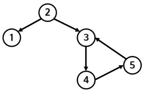
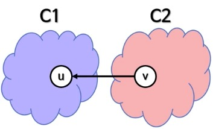

# 그래프1

# 그래프의 정의

## 그래프란?

"데이터(노드)들을 잘 정리하는 방법 중 하나"

- 노드: 정점vertex, 꼭지점point
- 잘 정리: 노드 간의 관계를
- 변, 간선(edge, line, link)


<br><br><br>

---

# 그래프의 예

예: 

- 서울 지하철 노선표
- POCU의 선수과목
- 전/현 직장동료
- 세탁기 사이클
- 게임의 스킬 트리

트리는? 방향 비순환 그래프 중 하나(DAG, directed acyclic graph)


<br><br><br>

---

# 그래프의 종류

## 그래프의 정의와 용도

- 데이터들과 그 관계를 보여주는 방법 중 하나
- 서로 연관있는 노드의 집합

> G = (N,E)

- 네트워크 형태의 관계를 보여주기에 적합
- 복잡한 실세계의 문제를 모델링하기에 적절
  - 네트워크 형태가 명백하게 안보이는 경우도 있음
  - 그래프 이론을 적절히 적용하면 시간복잡도를 확연히 줄일 수도 있음

## 그래프 관련 용어

- 노드(정점, 꼭짓점)
- 변(간선, 선)
- 차수(degree)
- 루프(loop)

## 그래프의 종류

- 방향/무방향(directed/undirected) 그래프
- 순환/비순환(cyclic/acycic) 그래프
- 가중/비가중(weighted/unweighited) 그래프

## 방향 vs 무방향 그래프

- 방향 그래프
  - 변이 한 방향만 가리킴
  - 꼬리 -> 머리로 이동은 가능
  - 머리 -> 꼬리로 이동은 불가능

- 무방향 그래프
  - 변에 특별한 방향이 없음
  - 따라서 양방향을 가리키는 것과 같음
  - 꼬리 -> 머리, 머리 -> 꼬리 모두 가능

## 무방향 그래프의 최대 변 개수

- 모든 노드가 연결되어 있는 경우
  - 단, 평행 변이나 루프는 없음
- 첫 번째 노드의 변: N - 1개
- 두 번째 노드의 변: N - 2개(중복된 것을 다시 세지 않음)
- 세 번째 노드의 변: N - 3개

## 순환 vs 비순환 그래프

- 비순환 그래프
  - 일단 떠나면 그 노드로 돌아오는 경로가 없음
  - 그래프 안의 모든 노드에 대해
- 순환 그래프
  - 떠난 뒤에도 그 노드로 돌아오는 경로가 있음
  - 그런 노드가 하나만 있어도 순환 그래프

## 가중 vs 비가중 그래프

- 비가중 그래프
  - 모든 변이 동일한 의미를 가짐
  - 각 변의 값이 같음
  - 별도의 표기 불필요
- 가중 그래프
  - 각 변의 관계 정도가 다름 (예: 거리, 시간)
  - 각 변의 값이 다름


<br><br><br>

---

# 그래프의 다양한 표현 방법

## 그래프를 사용해 풀 수 있는 문제들

* 여러 스케줄링 관련
* 두 위치 사이의 여행 경로 관련
* 분자를 구성하는 원자들의 결합 관련
* 인터넷에서 데이터 패킷이 전달되는 경로 관련
* 대규모 프로젝트에서 일감 사이의 의존성 관련
* 도시의 전기 공급 그리드 관련
* SNS에서 친구 관계 관련

그 외 다양한 문제 존재!

트리는 비교적 간단한 형태의 그래프였고 restriction이 많아 구현이 편했지만, 그래프는 그 표현에 테크닉적인 부분이 필요하다.


## 그래프의 다양한 표현 방법

1. 원과 선
2. 인접 행렬(adjacency matrix)
3. 인접 리스트(adjacency list)


## 1. 원과 선

- 사람이 가장 이해하기 쉬운 표현법
  - 한눈에 그래프를 파악 가능
  - 단, 노드와 변의 수가 적당해야 함
- 굳이 코드로 표현하면 트리와 비슷한 구조

```java
public class Node {
	public int data;
	public ArrayList<Node> neighbors = new ArrayList<>();
}
```
* 하지만 대규모 데이터 처리에 적합한 표현법은 아님


<br><br><br>

---

# 인접 행렬

## 2. 인접 행렬

* NxN 행렬
  * G[N][N]
  * N:그래프 G 안에 있는 노드 수
* 서로 인접한 노드를 표현
  * 인접: 두 노드 사이를 연결하는 변이 있음
  * 1에서 J로 향하는 변이 있다면 G[1][j] = 1
  * 없으면 G[i][j] = 0
* G가 가중 그래프이면 0/1 대신 실제 가중치를 저

자기 자신과 연결됐는지 여부는 따로 loop가 있지 않는 한 0으로 처리. 

eg. G[2][2] = 0


<br><br><br>

---

# 방향 그래프의 인접 행렬

## 인접 행렬 만들기 - 방향 그래프

특정 노드가 다른 노드를 가리키면 1, 가리키고 있지 않으면 0으로 처리.

예시:

```
0 0 1 0 // 가로(행)로 보면 해당 행의 노드가 어떤 노드를 가리키는지 알 수 있다.
1 0 0 1
0 1 0 0
0 0 0 0
// 세로(열)로 보면 해당 열의 노드를 어떤 노드가 가리키는지 알 수 있다.
```

## 인접 행렬의 장단점

|장점|단점|
|---|---|
|(일단 알면)쉽게 구현 가능|공간을 더 차지함 O(N2)|
|변 제거의 시간 복잡도가 0(1)|언제나 같은 공간을 차지. 연결된 노드가 많아도, 적어도.|
|다음과 같은 관계를 효율적으로 찾음: 노드 a에서 b로 가는 변이 존재하는가? -> 0(1)|인접 행렬을 만드는 시간은 0(N2)|
| |인접 노드를 찾는 시간은 0(N)|

연결돼있는 게 많지 않을 경우 인접 행렬은 낭비가 심해 그렇게 뛰어나지 않을 수 있다.


<br><br><br>

---

# 인접 리스트

## 3. 인접 리스트

* 각 노드마다 이웃의 리스트를 만듦
  * 리스트 N 개
  * 보통 연결 리스트 N 개를 배열에 저장
  * 연결 리스트 대신 다른 자료구조도 사용 가능
* 원과 선을 굳이 코드로 구현한 것과 큰 차이 없음(...)


## 인접 리스트의 장단점

|장점|단점|
|---|---|
|* 공간을 적게 사용|* 다음과 같은 관계를 찾는 게 느림|
|・・・・* O(N + E)|・・・・* 노드 a에서 b로 가는 변이 존재하는가?|
|・・・・* 최악(모든 노드끼리 연결돼 있을 시): O(N^2) = O(N + (N+ ((N - 1)/2))|・・・・* O(1)보다 느림|
|* 삽입/삭제가 빠름| |
|・・・・* 연결 리스트를 사용했을 경우| |


## (supplementary)기타 표현 방법

* 결합 행렬(incidence matrix)
* 결합 리스트(incidence list)
* 연산에 따라 이 표현법을 사용하는 게 더 쉽기도 함


<br><br><br>

---

# 그래프의 깊이 우선 탐색

 ## 그래프의 DFS와 무한루프

```java
public static void searchDepthFirst(Node node) {
	Stack<Node> stack = new Stack<>();

	stack.push(node);

	while (!stack.empty()) {
		Node next = stack.pop();

		System.out.println(next.data);

		for (Node child : next.children) {
			stack.push(child);
		}
	}
}
```

## 무한루프의 해결법

* 이미 처리했던 노드를 다시 처리하면 안 됨
* 방문했던 노드를 기억할 방법이 필요
  1. 전역적으로 방문했던 노드를 기억(예: HashSet<Node>)
  2. 각 노드마다 방문했는지 여부를 기억(예: boolean)
* 두 번째 방문 시 처리 안 하고 곧바로 다음 노드로 넘어감


## 방문 노드 기억하기

```java
// 중복 방문 여전히 발생!
public static void searchDepthFirst(Node node) {
	HashSet<Node> visited = new HashSet<>(); // 추가
	Stack<Node> stack = new Stack<>();

	stack.push(node);

	while (!stack.empty()) {
		Node next = stack.pop();

		System.out.println(next.data);

		visited.add(next);

		for (Node neighbor : next.neighbors) {
			if (!visited.contains(neighbor)) { // 조건 추가
				stack.push(neighbor);
			}
		}
	}
}
```


<br><br><br>

---

# 올바른 노드 기억법

## 올바른 노드 기억법

옵션1. 스택에 이미 들어간 노드는 다시 안 넣음
옵션2. 스택에서 pop()을 한 후에 이미 방문했던 노드인지 확인

## 발견한 노드 기억하기

```java
// 어떤 노드든 stack에 넣기 전에 무조건 discovered에 추가	
public static void searchDepthFirst(Node node) {
	HashSet<Node> discovered = new HashSet<>(); // 변경
	Stack<Node> stack = new Stack<>();

	stack.push(node);
	discovered.add(node); // 추가

	while (!stack.empty()) {
		Node next = stack.pop();

		System.out.println(next.data);

		// visited.add(next); // 삭제

		for (Node neighbor : next.neighbors) {
			if (!discovered.contains(neighbor)) {
				stack.push(neighbor);
				discovered.add(neighbor); // 추가
			}
		}
	}
}
```


<br><br><br>

---

# 후위 순회 DFS

## 그래프의 모든 노드 방문하기

- 그래프에는 루트 같이 특수한 노드가 없음
  - 루트: 모든 노드와 직간접적으로 연결되는 노드
  - 방향 그래프, 끊어진 노드 때문
- 일반적인 DFS는 모든 노드를 방문하지 못할 수 있음
- 해결책: DFS의 인자로 모든 노드 목록을 전달
  - 각 노드를 기점으로 DFS를 한 번씩 실행하는 것과 마찬가지
  - 단, 방문 목록을 공유하기에 중복 방문은 없음


## 후위 순회 DFS

- 방금 본 DFS는 전위(pre-order) 순회
  - 현재 노드를 방문 후, 자식 노드로 진행
- 후위(post-order) 순회로도 가능
  - 자식 노드들을 다 방문 후, 현재 노드를 처리
  - 재귀 함수로 만드는 게 더 쉬움


## 후위 순회 DFS 재귀 알고리듬

그래프의 각 노드에 대해
1. DFS 함수를 호출
  1. 현재 노드를 발견한 것으로 표시
  2. 처음 발견한 이웃 노드마다 DFS를 호출
2. 현재 노드를 방문

(발견 표시와 방문 별개)


<br><br><br>

---

# 그래프 DFS의 시간 복잡도

## 그래프 DFS의 시간 복잡도

> O(N + E)

- 이유
  - 각 노드는 최대 한 번 처리됨 -> O(N)
  - 각 변은 최대 두 번 고려됨 -> O(E)
    - 내려갈 때 한 번, 올라갈 때 한 번

트리의 DFS도 O(N + E) 인가요?

맞다. 하지만 E = N - 1 이다(트리에서만). 그래서 O(N + E) -> O(N + N - 1) -> O(2N - 1)이니 O(N)!


<br><br><br>

---

# 위상 정렬

## 위상 정렬(topological sorting)

- 그래프의 노드를 선형(일직선)으로 정렬하는 방법
- 우선순위가 바뀌지 않음
  - 예: B 노드를 가리키던 모든 노드들이 B 보다 전에 나옴
- DAG만 유효한 위상 정렬이 가능
  - 순환(cycle)하는 노드가 있다면 우선순위 판단이 불가능
  - 시작점이 존재해야 함
- 해답이 여럿일 수 있음

## (supplementary)위상 정렬 알고리듬

- 몇 가지 알고리듬이 존재
  - 깊이 우선 탐색(DFS)
  - 칸 알고리듬(Kahn's algorithm)
- 크게 두 가지 용도
  - 실제로 위상 정렬을 함
  - 위상 정렬 가능한 그래프인지 판단


<br><br><br>

---

# DFS를 사용한 위상 정렬

## (supplementary)DFS를 사용한 위상 정렬

- DFS만으로 간단히 위상 정렬을 할 수 있음
- 두 가지 중 어떤 것?
  - 전위 순회 X
  - 후위 순회 O
    - 수행후 역순으로 따라하면 된다!(후위 순회 결과의 역순)
    - 거꾸로 실행하기에 적합한 자료구조? 스택, 연결리스트...


## 위상 정렬의 용도

- 관계에서 순서를 정하는 매우 많은 곳에 사용 가능
  - 프로젝트 일정 만들기
  - CPU 명령어 실행 순서 결정
  - 스프레드 시트 셀 평가 순서 결정
  - 컴파일 순서 결정
  - DB 테이블 로딩 순서 결정
  - 선수 순위 결정

위상 정렬의 올바른 시간 복잡도는? O(N + E)!


<br><br><br>

---

# 강한 결합 요소

## 송수관 깔기 문제

- 자체적으로 식수를 조달하던 POCU 마을
- 상류에 세운 새로운 댐 때문에 물길이 끊김
- 다른 마을로부터 물을 받기로 결정
- 이때 어디에 송수관을 연결해야 할까?
  - 당연히 적게 연결할수록 비용 절감
  - 하지만 모든 집에 식수가 도달해야 함


어느 노드가 적합할까?

(힌트: 물은 한 방향으로만 흐름)

진입 차수가 0인 곳!


## 세 노드의 관계 = 강한 결합 요소

노드1 -> 노드2 -> 노드3 -> 노드1

의 순환 그래프가 있다고 한다면

- 1에서 출발해서 다른 노드에 도착 가능
- 2에서 출발해서 다른 노드에 도착 가능
- 3에서 출발해서 다른 노드에 도착 가능
- 모든 노드가 직간접적으로 연결!
  - 이걸 강한 결합 요소라고 함
  - Strongly Connected Component(SCC)


<br><br><br>

---

# 위상 정렬과 강한 결합 요소

## 송수관 연결 문제

- 각 SCC를 한 노드로 생각하면 단순해짐!
  - 그중 한 노드에만 도달하면 되기 때문


## 강한 결합 요소(SCC, Strongly Connected Component)

- 방향 그래프에서 끈끈한 관계를 가지는 노드들의 ***최대*** 그룹
  - 그 그룹에 속한 두 노드는 어떻게든 연결되어 있음
  - 반드시 이웃은 아님
- 정의
  - C(component) ⊆ N(모든 nodes)
  - C에 속한 모든 정점 쌍 u, v에 대해 u -> v이고 v -> u인 가장 큰 집합


## SCC의 주용도는 최적화!

- 다른 알고리듬에서 고려해야 할 정점 수를 줄여줌
  - 방금 본 문제가 그 좋은 예!
- 또 다른 예
  1. 그래프를 여러 SCC로 분리
  2. 각 SCC에 대해 알고리듬을 실행
  3. 그 결과를 합침
- 실제 문제를 풀기 위해 SCC를 사용하는 경우도 있음


## 송수관 처음부터 깔기 문제

- 이미 존재하는 송수관이 없음
- 하루에 모두 다 설치할 수 없음
  - 부분별로 설치를 해나가야 함
- 공사 완료된 집은 수도가 열렸으면 함
- 설치 순서 결정하기!

어떤 알고리즘을 사용해야 할까?(힌트: 노드를 순서대로 나열하기)

위상 정렬?


## 위상 정렬과 SCC

* 순환 그래프는 위상 정렬이 불가능
* 순환하는 노드들은 SCC로!
* SCC로 치환한 그래프는 DAG!
  * 이제 위상 정렬 가능!
  * 각 존(zone)의 공사 순서를 결정할 수 있음
* 이렇게 위상 정렬을 하기 위해 SCC를 사용하는 일이 흔함


## (supplementary)강한 결합 요소 알고리즘

* DFS 기반 알고리즘
  * 코사라주 알고리즘(Kosaraju's algorithm)
  * 타잔 알고리즘(Tarzan's algorithm)
  * 경로 기반 알고리즘
* 도달 가능성 기반 알고리즘(분할 정복)


<br><br><br>

---

# (supplementary)코사라주 알고리즘

1. 그래프 G를 DFS 후위 순회(역순)한다
2. 전치 그래프 G^T를 계산한다
  - 전치 그래프: ***변의 방향이 반대***인 그래프
3. G^T의 각 노드에서 DFS를 실행한다
  - 1에서 찾은 순서대로
  - 각 DFS 실행에서 얻은 목록이 강한 결합 요소!


<br><br><br>

---

# 코사라주 알고리즘의 이해

## 코사라주 알고리즘의 이해 - 첫 번째 단계

(그래프 G를 DFS 후위 순회(역순)한다)

* 실행 결과가 올바른 선후 관계를 보장
* 예: DFS 시작 노드 순서에 따른 결과
  * 12345: 1 5432 -> 2345 1
  * 13245: 1 543 2 -> 2 345 1
  * 52431: 435 12 -> 21 534



* 일반화
  * C1과 C2는 G에 있는 강한 결합 요소
  * u ∈ C1, v ∈ C2
  * u는 언제나 v 전에 있음


## 코사라주 알고리즘의 이해 - 두 번째 단계

(전치 그래프 G^T를 계산한다)

* G^T에서도 C1과 C2는 여전히 SCC


## 코사라주 알고리즘의 이해 - 세 번째 단계

(G^T의 각 노드에서 DFS를 실행한다)

* 처음 DFS를 시작하는 노드는 C1 소속
  * u가 v앞에 있기 때문
* C1의 DFS는 C1 속 노드만 방문하고 끝
  * u -> v인 변이 없기 때문
  * 이때 C1 속 노드를 모두 방문함
* 다음에 DFS를 시작하는 노드는 C2 소속
* 결론
  * C1과 C2는 완전히 분리
  * C1과 C2는 독자적인 SCC!




## 강한 결합 요소의 용도

- 주로 복잡한 네트워크 관계 관련
  - 신경 과학에서도 사용
- 방대한 양의 데이터에서 연관된 그룹 찾기에 유용
- 예:
  - 여전히 진입이 가능하게 보장하면서 일방 통행로 봉쇄하기
  - 한 도시에서 다른 도시로 비행기 여행이 가능한지 확인
  - SNS에서 직장동료, 학교 동기 찾기
  - SNS에서 취미나 성향이 같은 사람 찾기


<br><br><br>

---

# 정리

- 그래프에서는 발견한 노드를 기억하는 게 꽤 중요하다.
- 위상 정렬
  - 의존성 등이 존재하고 어떤 걸 먼저 해야할지 정리할 때
  - 선형적으로 순서를 보고 싶을 시
  - 적용이 가능 케이스
    - 순환이 없고
    - 방향이 있는 그래프일 시
  - 어떤 문제를 봤을 때 이걸 위상 정렬로 표현할 수 있단 걸 아는 과정이 꽤 힘들긴 하다. 실제 문제를 보고, 분석하고, 적용해보는 이런 과정들이 그래프 알고리즘을 만들고 실무에 적용하는 데에 가장 큰 문제 중 하나이다.
  - 경력, 경험, 패턴 익히며 알아가는 것이다. 한 번에 모든 걸 설명하긴 어렵다.
- 강한 결합 요소
  - 최근 SNS 등에서 활용도가 높아 주목을 받고 있다.


