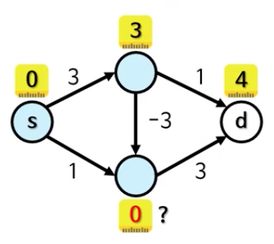

# 그래프2

# 그래프의 너비 우선 탐색


## 너비 우선 탐색

* 트리에서 봤던 너비 우선 탐색
* 원래는 그래프에 사용 가능한 것
  * 트리는 특별한 제약이 있는 그래프
  * 깊이 우선 탐색도 마찬가지였음
* 단, 방문한 노드를 기억해야 함
  * 실제로는 발견한 노드를 기억
  * 깊이 우선 탐색에서 이미 본 것


## 그래프의 너비 우선 탐색 코드

```java
public static void searchBreadthFirst(Node node) {
	HashSet<Node> discovered = new HashSet<>();
	Queue<Node> queue = new LinkedList<>();

	queue.add(node) ;
	discovered.add(node);

	while (!queue. isEmpty()) {
		Node next = queue.remove;
		System.out.print(next.data + " ");

		for (Node neighbor : next.neighbors) {
			if (!discovered.contains(neighbor)) {
				queue.add (neighbor); 
				discovered.add (next);
			}
		}
	}
}
```


<br><br><br>

---

# 그래프 BFS의 시간 복잡도

> O(N + E)


<br><br><br>

---

# 최단 경로 찾기

# 최단 경로 찾기(shortest path)

* 집에서 학교로 가는 길
* 각 변은 두 노드를 연결하는 도로 의미
* 학교로 가는 경로는 여러 가지
* 사실 순환(cycle)이 있기에 경로는 무한
  * ~~학교 가기 싫은 아이~~

가장 짧은 경로를 찾아보자!


* 가장 간단한 방법은 주먹구구식
  * 모든 가능한 조합을 만든 뒤, 그중 가장 짧은 것을 선택
  * 단, 순환이 없게끔 해야 함
* 하지만 이 방법은 엄청난 시간 복잡도
* BFS를 사용하면 최단 경로를 찾을 수 있음!
  * 시간 복잡도도 O(N + E)!


## BFS가 최단 경로를 찾는 이유

* S는 시작 노드, d는 도착 노드
* 현재 깊이의 모든 노드를 방문 후 다음 깊이로 진행
  * 깊이 n-1에서는 d 노드를 찾지 못했음
  * 깊이 n을 뒤지다 보면 d 노드를 찾음
* 따라서 BFS는 언.제.나. 최단 경로를 찾음!
  * 제대로 된 증명을 보고 싶다면 구글 검색! 'BFS shortest path proof'


 
<br><br><br>

---

# BFS로 최단 경로 찾기

## BFS로 최단 경로 찾기

- 기본적인 BFS와 크게 다르지 않음
- 그러나 시작점부터 현재 노드까지의 거리를 기억해야 함
  - 거리 = BFS 깊이
  - 약간의 코드 수정만 필요!
- 저장법은 여러 가지
  - 해시 맵에 모든 노드의 거리를 저장
  - 2D 배열로 저장(인접 행렬과 비슷한 모습)
  - 각 노드 안에 거리를 저장(BFS를 실행하기 전에 리셋해줘야 함)
    - DFS의 경우와 마찬가지로 엄밀히는 올바른 OOP가 아닐 수 있다.

```java
public static int findShortestDistance(Node s, Node d) {
	HashMap<Node, Integer> distances = new HashMap<>();
	Queue<Node> queue = new LinkedList<>();

	queue.add(s);
	distances.put(s, 0);

	while (!queue.isEmpty()) {
		Node next = queue.remove();
		int distnace = distances.get(next);

		if (next.equals(d)) {
			return distance;
		}

		for (Node neighbor : next.neighbors) {
			if (!distances.containsKey(neighbor)) {
				queue.add(neighbor);
				distances.put(neighbor, distance + 1);
			}
		}
	}

	return -1;
}
```

- 최종 노드부터 반대 방향으로 추적
- 추적을 위해 추가 정보 필요
  - 선행 노드: '누가 나를 큐에 넣었는가?'
  - 큐에 다음 노드를 넣을 때 선행 노드도 같이 기재
- 정보 저장 방법은 여러 가지
  - 해시 맵에 기억(키: 내 노드, 값: 선행 노드)
  - 노드 속에 선행 노드를 기억(BFS 실행 전에 이 값을 리셋해줘야 함)
  - 등

## 각 변의 거리가 다른 최단 경로 찾기

- BFS로 간단히 해결할 수 없음
  - 가중 그래프
  - BFS의 깊이 != 거리

다른 알고리즘이 필요!


<br><br><br>

---

# 다익스트라 알고리즘의 기초

## 다익스트라 알고리즘(Dijkstra's algorithm)

- 두 노드 사이의 최단 경로를 찾음
- 방대한 노드 네트워크에 사용하기 충분히 빠름(몇 천~몇 만+)
- 변의 가중치가 음수인 경우에는 제대로 작동하지 않음
- 실세계에서 많이 사용
  - 지도/내비게이션
  - IP 라우팅
  - 경유 항공편 찾기
  - 등


## 다익스트라 알고리즘의 기초

- 모든 노드를 한 번씩 방문하며 아래의 연산을 함
  1. 아직 방문 안 한 노드 중 가장 가까운 노드 n을 선택
  2. n의 각 이웃 노드 m으로 여행하는 거리를 계산(n의 거리 + n -> m 거리)
  3. 이 결과가 m의 기존 거리보다 가까우면 m의 거리를 업데이트
- 모든 노드를 방문하면 최단 거리를 찾음
  - 모든 노드를 거쳐 온 경로 중 최솟값을 취했기 때문

(TIP: 이런 알고리즘을 처음부터 만들려고 하면 힘들어 못 만든다. 다른 사람이 만들어 놓은 걸 가져와서 쓰면 된다. 이런 그래프 알고리즘들은 내가 어떤 알고리즘을 고안하는 문제보다는 이미 있는 알고리즘에 내 문제를 접목시키는 것. 또는 이 문제가 있고 이 문제가 특정 그래프 알고리즘으로 풀 수 있는 문제라, 그러기 위해선 노드와 변을 어떻게 구성해야 된다라는 걸 디자인해야 하는데, 그게 오히려 어려운 부분이긴 하다. 결국 여러가지 문제를 풀면서 해결하는 방법 밖에 없다.)

어떤 알고리즘 기법이 생각나나요?  
그리디?(가장 가까운 노드 n을 선택...)  
다익스트라는 동적 계획법(DP)!


<br><br><br>

---

# 다익스트라 알고리즘 1

## (supplementary)다익스트라 알고리즘

1. 아직 방문 안 한 노드 중 가장 거리 값이 작은 노드 n을 선택
2. n의 각 미방문 이웃 m으로 가는 더 짧은 경로가 있다면 업데이트
  - min
    - 현재까지 알려진 m의 거리
    - 현재까지 알려진 n의 거리 + n -> m 거리
3. 다음 조건 중 하나를 만족하기 전까지 1~2를 반복
  - 모든 노드를 방문했음
  - n이 목적지임
4. 목적지까지의 거리/경로를 반환


<br><br><br>

---

# 다익스트라 알고리즘 2


<br><br><br>

---

# 다익스트라의 시간 복잡도

## 인접 행렬의 문제

노드는 수백만 개인데 변은 몇 개 안 되면?

eg. 지도 앱  
노드: xx 교차로  
변: 4개  
서울 시내 교차로 수: 그냥 많음(...)  
n^2 -> 수백만^2(...)

따라서 인접 리스트로 만들어야 한다.  
인접 리스트를 사용한단 가정하에 시간 복잡도를 보자.


## 시간 복잡도

- 방문하는 노드 수(=알고리즘 실행 횟수): N
  - 최소 거리 노드 선택: N
- 모든 변을 한 번씩은 지나감: E
  - 거리 값 업데이트: 1

> O(N^2 + E) = O(N^2)


- 최소 거리 노드 선택: N -> logN으로 빠르게 만들 수 있다.
  - 우선순위 큐(이진 힙) 사용시
    - 최소값을 찾을 땐 O(1)이긴 하지만, 제거할 때마다 최소값이 위로 다시 올라와야하고 리밸런싱 해야하는데 그 비용이 O(logN).
- 거리 값 업데이트: 1 -> logN
  - 거리값이 업데이트되면 우선순위 큐에 들어가있던 노드의 구조들이 리밸런싱이 되어야 하므로.

> O(NlogN + ElogN) = O((N + E)logN)

우선순위 큐 대신 BST를 사용해도 시간 복잡도는 같다.


## 더 빠른(?) 자료 구조

- 피보나치 힘을 사용하면 이론 상 시간 복잡도를 더 줄일 수 있음
  - O(E + N log N)
- 우선순위를 다시 정렬하는 시간이 0(1). 거의 대부분의 경우.
  - 최악의 경우 삭제가 O(N)이 걸릴 수도 있음
- 코드로 옮기기 복잡
- 실제 실행 속도는 다른 힙보다 그다지 안 빠를 수 있음
  - 중간에 공간을 더 잡아먹는다던가, 포인터를 더 사용한다던가 등...


<br><br><br>

---

# 다익스트라와 음의 가중치

## 다익스트라와 음의 가중치

- 다익스트라는 음의 변이 있을 경우 오작동
  - 한 번 방문한 노드는 다시 방문 안 하기 때문
    - 변의 가중치가 언제나 양수라 가정한 알고리즘
      - 다음 거리는 언제나 이미 방문한 거리 이상



그럼 음수인 변이 있으면 최단 거리를 못 찾나요? -> 벨만-포드 알고리즘으론 된다!


<br><br><br>

---

# 코드보기: 우선순위 큐를 사용한 다익스트라 알고리즘

```java
public final class Node {
	private final String name;
	private final HashMap<Node, Integer> roads = new HashMap<>();

	public Node(final String name) {
		this.name = name;
	}

	public Map<Node, Integer> getRoads() {
		return this.roads;
	}

	public void addRoad(final Node to, final int dist) {
		this.roads.put(to, dist);
	}

	public int getDistance(final Node to) {
		return this.roads.get(to);
	}
}
```

```java
public class Dijkstra {
	private Dijkstra() {
	}

	public static HashMap<String, Integer> run(
		// nodes에는 언제나 시작 노드(name이 from에 저장된 문자열인 노드)가 있다고 가정
		// from은 시작 노드의 이름
		// prevs는 최단 경로에 있는 노드의 선행 노드를 저장하는 맵. eg. 키가 "school", 값이 "police station"이라면, 최단 경로에서 "school" 이전에 방문했던 노드가 "police station"이라는 뜻
		final HashMap<String, Node> nodes,
		final String from,
		final HashMap<String, String> prevs) {


		// 메서드의 결과 여기에 기록. 각 노드까지의 최단 거리를 저장하는 맵.
		HashMap<String, Integer> minDists = new HashMap<>();

		// 각 노드까지의 최단 거리를 일단 무한(Integer.MAX_VALUE)으로 초기화
		final int INF = Integer.MAX_VALUE;
		for (var entry : nodes.entrySet()) {
			String name = entry.getKey();

			minDists.put(name, INF);
		}

		minDists.put(from, 0);

		prevs.put(from, null);

		// open은 최단 경로일 가능성이 있는 경로(이하 후보 경로)들을 저장
		PriorityQueue<Candidate> open = new PriorityQueue<>();

		// candidate는 후보 경로의 총거리를 나타내는 클래스
		Nodes s = nodes.get(from);
		Candidate candidate = new Candidate(s, 0);

		open.add(candidate);

		// 더 이상 후보 경로가 없을 때까지 반복
		while (!open.isEmpty) {
			candidate = open.poll();

			// 후보 경로의 거리가 현재까지 알려진 최단 거리보다 길다면 무시하고 다음 후보를 봄
			Node n = candidate.getNode();
			String nodeName = n.getName();

			int minDist = minDists.get(nodeName);
			int dist = candidate.getDistance();

			if (minDist < dist) {
				continue;
			}

			Map<Node, Integer> roads = n.getRoads();

			for (var e : roads.entrySet()) {
				Node next = e.getKey();

				// 각 이웃까지의 새로운 거리 계산
				int weight = e.getValue();
				int newDist = minDist + weight;

				String nextName = next.getName();
				int nextMinDist = minDists.get(nextName);

				// 그 결과를 현재까지 알려진 최단 거리와 비교
				if (newDist >= nextMinDist) {
					continue;
				}

				minDists.put(nextName, newDist);
				prevs.put(nextName, nodeName);

				Candidate newCandidate = new Candidate(next, newDist);

				open.add(newCandidate);
			}
		}
	}
}
```
```java
public class Program {
	public static void main(String[] args) {
		// 그래프를 만드는 메서드. 코드는 강의에.
		HashMap<String, Node> nodes = createNodes();

		HashMap<String, String> prevs = new HashMap<>();

		HashMap<String, Integer> minDists = Dijkstra.run(nodes, "Home", prevs);

		int schoolDist = minDists.get("School");
		System.out.println(schoolDist);

		int bankDist = minDists.get("Bank");
		System.out.println(bankDist);

		int libDist = minDists.get("Library");
		System.out.println(libDist);

		// prevs 맵을 사용해 "Home"에서 "School"까지의 최단 경로 찾기
		LinkedList<String> path = new LinkedList<>();

		String name = "School";
		while (name != null) {
			path.addFirst(name);
			name = prevs.get(name);
		}

		String pathString = String.join(" -> ", path);
		System.out.println(pathString);
	}
}
```


<br><br><br>

---

# A* 알고리즘

## 다익스트라는 훌륭, 하지만...

- 언제나 목적지까지의 최단 경로를 찾아줌
- 시간 복잡도도 훌륭
- 실제 똑똑한 알고리즘인지 그려보면?


## A* 알고리즘

- 다익스트라와 기본은 같은 알고리즘
- 하지만 쓸데없는 평가를 피할 수 있음
- 예: 서울에서 부산 가기
  - 다익스트라: 경부선, 호남선, 경인선, 경원선을 모두 탐색
  - A*: 경부선만 따라 쭉 달림
- 이를 위해 다음 노드 선택 시 기준을 하나 더 추가
  - 다익스트라의 기준은 시작점부터 노드까지의 거리
  - A* 가 추가하는 기준은 그 노드로부터 목적지까지의 거리


## 현재 노드부터 목적지까지의 거리

- 목적지까지 탐색을 다 하기 전까지는 확실히 모름
- 따라서 A* 가 추가한 기준은 결정적이 아님!
  - 휴리스틱
  - 근사치
- 이 휴리스틱 함수에 따라 A* 의 성능이 달라짐
- 대부분의 경우 다익스트라 보다 빠름
  - 실세계의 대표 경로 찾기 알고리즘이 A* 인 이유
  - 하지만 데이터 따라 느릴 수도 있음


<br><br><br>

---

# A* 의 노드 선택 기준

## A* 의 두 가지 노드 선택 기준

- g(n): 시작 노드부터 노드 n까지의 거리(실제 값)
- h(n): n부터 목적지 노드까지의 거리(추정치. h for heuristics.)
- f(n): 시작 노드부터 목적지 노드까지의 거리(추정치)
  - f(n) = g(n) +h(n)
- 다음 노드 선택 시
  - 다익스트라는 g(n)이 최소인 것을 선택
  - A* 는 f(n)이 최소인 것을 선택


## A* 의 h(n)

- 계속 목적지 방향으로 나아가고 싶음
  - = 목적지 쪽에 있는 노드를 우선적으로 선택하고 싶음
  - = 목적지 쪽에 있는 노드의 h(n)이 더 작아야 함
  - = 목적지에 가까운 노드의 h(n)이 더 작아야 함
- 즉, h(n)은 거리 함수!
  - 모든 상황에 최고인 함수는 없음
  - 상황에 따라 선택
    - 예: 유클리드 거리, 맨해튼 거리


## (supplementary)구현 시 다익스트라와의 차이점

- OPEN이란 이름의 노드 집합이 있음
  - 방문할 최단 경로 후보 노드들이 들어있음
- OPEN 안에 있는 후보 선택 시 최소 f(n)을 이용
- 같은 노드를 두 번 이상 방문할 수 있음
  - 그 이유는 뒤에 봄


<br><br><br>

---

# A* 알고리즘

## (supplementary)A* 알고리즘

1. 그래프에 있는 모든 노드의 g(n)과 f(n)을 ∞으로 초기화
2. g(s) = 0, f(s) = h(s)
3. 시작 노드 s를 OPEN에 추가
4. OPEN에서 f(n)이 가장 작은 노드를 찾아 제거
5. n의 각 이웃 m에 대해 시작점 -> n -> m이 더 짧은 경로라면
  - g(m)을 업데이트
  - m을 OPEN에 추가
6. 목적지에 도달하거나 OPEN이 빌 때까지 4~5번 과정을 반복

A* 는 heuristic이기 때문에 반드시 최단 경로를 알려주지는 않는다. 그보단 얼마나 빠르게 연산할 수 있는지가 중요한 알고리즘.


<br><br><br>

---

# h(n) 함수에 대한 이해

## h(n) 함수에 대한 이해

- h(n)의 결과와 실제 결과의 관계에 따라 A* 알고리즘이 행동이 바뀜
- 몇 가지 관계를 볼 예정
- 그전에 함수 하나를 정의하자!
  - h'(n):n -> 목적지로 이동하는 실제 비용

h'(n)은 실제 거리


## h(n) == 0

- h(n)이 언제나 0인 경우
- A* 가 다익스트라 알고리즘과 똑같이 동작

f(n) = g(n) + h(n)  
f(n) = g(n) + 0  
f(n) = g(n)  


## h(n) <= h'(n)

- 추정 거리가 실제 거리 이하인 경우
- 이때 h(n)을 허용할 수 있다(admissible)고 함
- 언제나 이러면 A* 는 최단 거리를 찾음
  - 하나라도 안 그러면 보장 못 함

h(n) <= h'(n) 이 조건을 만족하도록 h()함수를 유지하는 게 은근히 중요.


## h(n) << h'(n)

- 추정 거리가 실제 거리보다 훨씬 작음
- A* 가 더 많은 경로를 탐색
- 따라서 탐색 범위가 넓어짐
  - 다익스트라가 굉장히 넓게 탐색했던 걸 기억할 것!
  - 속도가 느려짐


## h(n) == h'(n)

- 추정 거리가 실제 거리와 같음
- 언제나 최고의 경로를 따라 감
- 알고리즘이 매우 빠름!


<br><br><br>

---

# A* 의 중복 방문과 시간 복잡도

## A* 가 중복 방문을 허용하는 이유

- 다익스트라는 새로 방문하는 노드의 실제 거리가 최소
  - 실제 거리 g(n)만 노드를 뽑는 기준으로 사용하기 때문
  - 이미 최소기에 더 이상 작아질 수 없음
- A* 는 새로 방문하는 노드의 거리가 실제 거리가 아님
  - h(n)으로 추정하는 부분이 있음
  - 지금 최소 거리라 믿고 뽑는 노드가 실제로는 최소가 아닐 수 있음
  - 나중에 다른 경로를 통해 방문하면 거리가 작아질 수도 있음
- 그러나 h(n)이 특정 조건을 만족하면 노드를 한 번씩만 방문함
  - 일관적(consistent)/단조로운(monotone) 휴리스틱
  - 특정 조건: h(n) <= dist(n, m) + h(m)


## (supplementary)시간 복잡도

- 여러 가지 요소에 따라 달라짐
  - OPEN에 사용하는 자료 구조
  - 휴리스틱 함수 h(n)
- 다음과 같은 경우에는 시간 복잡도가 다익스트라와 같아짐
  - h(n)이 O(1)
  - OPEN이 피보나치 힙을 사용
- 참고: AI 분야에서는 O(b^d)로 시간 복잡도를 나타냄
  - b: branch sector. 한 노드에 왔을 때 몇 개의 브랜치를 나눠서 볼 것인지.
  - d: depth. 그 브랜치로 갔을 때 깊이가 몇인지. 결국, 최단 경로를 말하는 것.

A* 는 시간 복잡도는 똑같아도 실행되는 속도를 빠르게 하기 위한 방법이었고, 그걸 위해 휴리스틱을 사용했을 뿐이다. 시간 복잡도가 같아도 실무에선 A* 가 압도적으로 빠른 경우가 훨씬 많아.


<br><br><br>

---


<br><br><br>

---


<br><br><br>

---


<br><br><br>

---