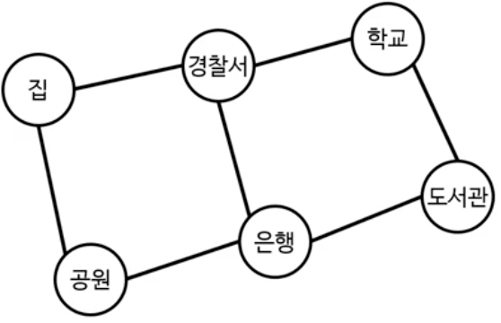

# 그래프2

# 그래프의 너비 우선 탐색


## 너비 우선 탐색

* 트리에서 봤던 너비 우선 탐색
* 원래는 그래프에 사용 가능한 것
  * 트리는 특별한 제약이 있는 그래프
  * 깊이 우선 탐색도 마찬가지였음
* 단, 방문한 노드를 기억해야 함
  * 실제로는 발견한 노드를 기억
  * 깊이 우선 탐색에서 이미 본 것


## 그래프의 너비 우선 탐색 코드

```java
public static void searchBreadthFirst(Node node) {
	HashSet<Node> discovered = new HashSet<>();
	Queue<Node> queue = new LinkedList<>();

	queue.add(node) ;
	discovered.add(node);

	while (!queue. isEmpty()) {
		Node next = queue.remove;
		System.out.print(next.data + " ");

		for (Node neighbor : next.neighbors) {
			if (!discovered.contains(neighbor)) {
				queue.add (neighbor); 
				discovered.add (next);
			}
		}
	}
}
```


<br><br><br>

---

# 그래프 BFS의 시간 복잡도

> O(N + E)


<br><br><br>

---

# 최단 경로 찾기

# 최단 경로 찾기(shortest path)

* 집에서 학교로 가는 길
* 각 변은 두 노드를 연결하는 도로 의미
* 학교로 가는 경로는 여러 가지
* 사실 순환(cycle)이 있기에 경로는 무한
  * ~~학교 가기 싫은 아이~~

가장 짧은 경로를 찾아보자!



* 가장 간단한 방법은 주먹구구식
  * 모든 가능한 조합을 만든 뒤, 그중 가장 짧은 것을 선택
  * 단, 순환이 없게끔 해야 함
* 하지만 이 방법은 엄청난 시간 복잡도
* BFS를 사용하면 최단 경로를 찾을 수 있음!
  * 시간 복잡도도 O(N + E)!


## BFS가 최단 경로를 찾는 이유

* S는 시작 노드, d는 도착 노드
* 현재 깊이의 모든 노드를 방문 후 다음 깊이로 진행
  * 깊이 n-1에서는 d 노드를 찾지 못했음
  * 깊이 n을 뒤지다 보면 d 노드를 찾음
* 따라서 BFS는 언.제.나. 최단 경로를 찾음!
  * 제대로 된 증명을 보고 싶다면 구글 검색! 'BFS shortest path proof'


 
<br><br><br>

---

# BFS로 최단 경로 찾기

## BFS로 최단 경로 찾기

- 기본적인 BFS와 크게 다르지 않음
- 그러나 시작점부터 현재 노드까지의 거리를 기억해야 함
  - 거리 = BFS 깊이
  - 약간의 코드 수정만 필요!
- 저장법은 여러 가지
  - 해시 맵에 모든 노드의 거리를 저장
  - 2D 배열로 저장(인접 행렬과 비슷한 모습)
  - 각 노드 안에 거리를 저장(BFS를 실행하기 전에 리셋해줘야 함)
    - DFS의 경우와 마찬가지로 엄밀히는 올바른 OOP가 아닐 수 있다.

```java
public static int findShortestDistance(Node s, Node d) {
	HashMap<Node, Integer> distances = new HashMap<>();
	Queue<Node> queue = new LinkedList<>();

	queue.add(s);
	distances.put(s, 0);

	while (!queue.isEmpty()) {
		Node next = queue.remove();
		int distnace = distances.get(next);

		if (next.equals(d)) {
			return distance;
		}

		for (Node neighbor : next.neighbors) {
			if (!distances.containsKey(neighbor)) {
				queue.add(neighbor);
				distances.put(neighbor, distance + 1);
			}
		}
	}

	return -1;
}
```

- 최종 노드부터 반대 방향으로 추적
- 추적을 위해 추가 정보 필요
  - 선행 노드: '누가 나를 큐에 넣었는가?'
  - 큐에 다음 노드를 넣을 때 선행 노드도 같이 기재
- 정보 저장 방법은 여러 가지
  - 해시 맵에 기억(키: 내 노드, 값: 선행 노드)
  - 노드 속에 선행 노드를 기억(BFS 실행 전에 이 값을 리셋해줘야 함)
  - 등

## 각 변의 거리가 다른 최단 경로 찾기

- BFS로 간단히 해결할 수 없음
  - 가중 그래프
  - BFS의 깊이 != 거리

다른 알고리즘이 필요!


<br><br><br>

---

# 


<br><br><br>

---


<br><br><br>

---


<br><br><br>

---


<br><br><br>

---


<br><br><br>

---


<br><br><br>

---


<br><br><br>

---


<br><br><br>

---


<br><br><br>

---


<br><br><br>

---


<br><br><br>

---


<br><br><br>

---


<br><br><br>

---


<br><br><br>

---